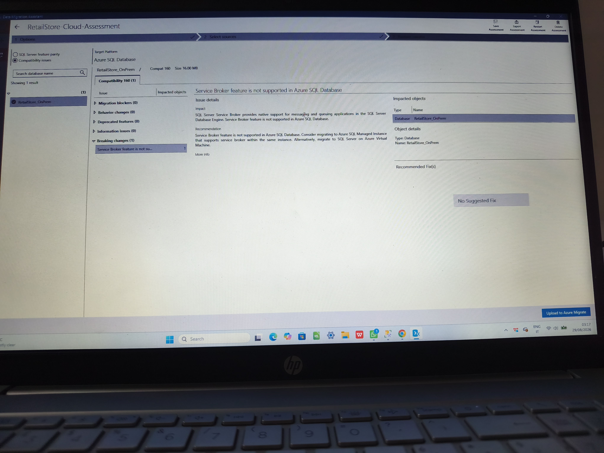
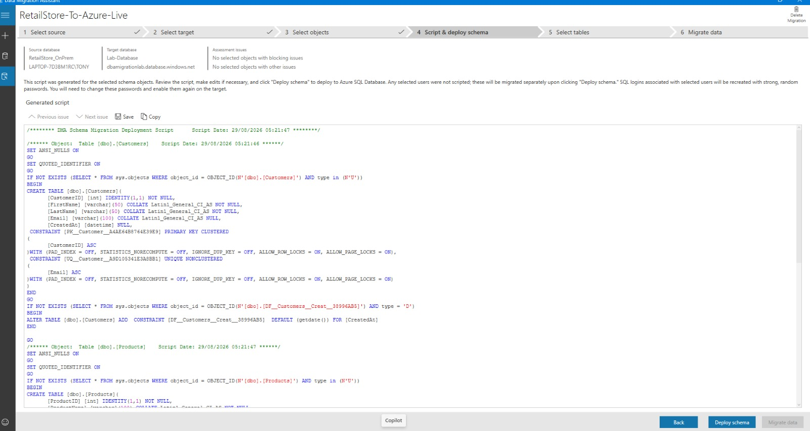
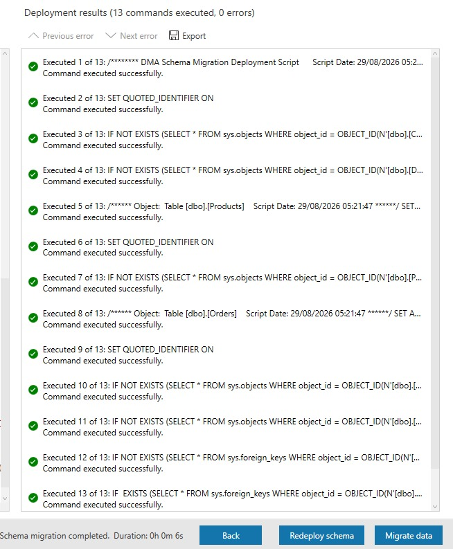
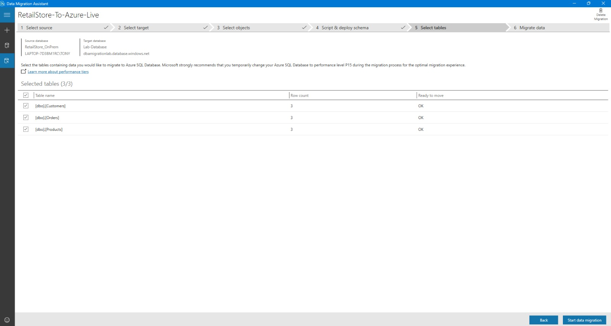
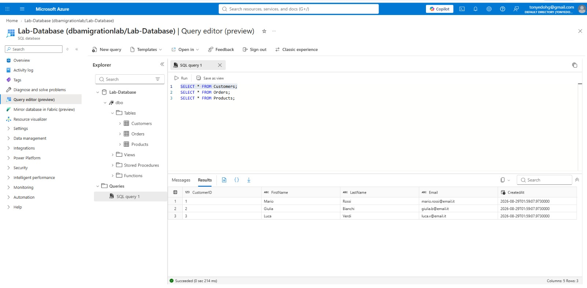
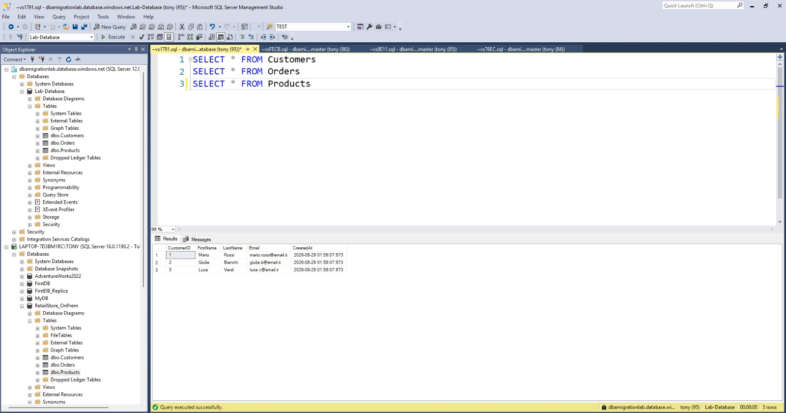
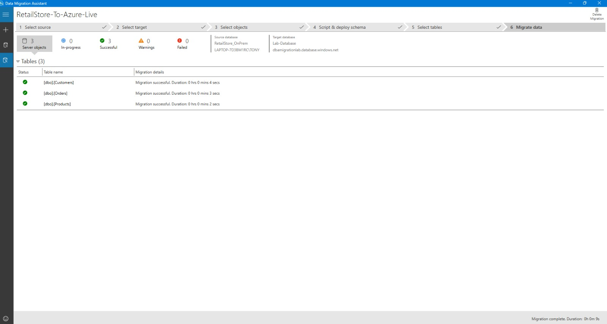

# On-Premises SQL Server to Azure SQL Database Cloud Migration Pipeline

## 📌 Project Overview
This project demonstrates a production-grade cloud migration of a transactional retail database (`RetailStore_OnPrem`) from an on-premises Microsoft SQL Server instance to a cloud-native **Azure SQL Database** single instance. 

The goal of this migration was to transition the infrastructure to a fully managed cloud database, reducing administrative overhead while ensuring data integrity, minimal downtime, and zero data loss.

---

## Tech Stack & Tools Used
*   **Database Engine:** Microsoft SQL Server (On-Premises source)
*   **Cloud Platform:** Microsoft Azure (Azure SQL Database target)
*   **Migration Engine:** Microsoft Data Migration Assistant (DMA)
*   **Management Tools:** SQL Server Management Studio (SSMS), Azure Portal Query Editor

---

## Migration Lifecycle & Step-by-Step Workflow

### Step 1: Cloud Assessment & Feature Compatibility
Before executing the migration, I performed a comprehensive compatibility assessment using the **Data Migration Assistant (DMA)** to detect potential architectural blocks.

*   **Discovery:** The assessment engine flagged a breaking change regarding the database's use of the **SQL Server Service Broker** feature, which is unsupported in standalone Azure SQL Database environments.
*   **Mitigation:** I successfully decoupled the messaging components and modified the backend dependencies to ensure the schema complied perfectly with cloud constraints before proceeding.

*   **Assessment Screenshot:**

---

### Step 2: Target Schema Generation & Cloud Deployment
With all architectural blockers successfully mitigated, I used the migration engine to generate Azure-compliant Data Definition Language (DDL) scripts for the core transactional tables: `Customers`, `Products`, and `Orders`.

*   Execution: The schema scripts were deployed directly to the Azure cloud target.
*   Result: '13 SQL commands executed successfully with 0 errors', establishing our relational keys, indices, and constraints in the cloud.

*   **Schema Deployment Screenshot:**

---

# Step 3: Data Mapping & Table Validation
Once the target database architecture was active in Azure, I initialized the data transfer pipeline. 

*   The engine mapped the source tables to the target cloud schema.
*   The system verified row layouts, data definitions, and data types, marking all core production tables as **"Ready to move"**.

* **Data Selection Screenshot:**

---

# Step 4: Data Transmission & Post-Migration Verification
The final phase focused on data ingestion and validating data integrity across environments.

*   **Data Ingestion:** Table data was securely streamed and loaded into the Azure target.
*   **Validation:** I performed parallel validation checks using **SQL Server Management Studio (SSMS)** on-premises and the native **Azure Portal Query Editor** in the cloud.
*   **Verification:** Verified that row counts, transaction timestamps, and relational constraints matched perfectly across both environments with zero data corruption or loss.

*   **Validation Screenshots:**

    **Successful Data Migration Screenshot:**

---
## 🎯 Key Achievements & Takeaways
*   **Blocker Mitigation:** Identified and resolved cloud incompatibility bugs (Service Broker limitations) prior to migration.
*   **Zero Data Loss:** Successfully migrated relational data records with 100% data integrity verified.
*   **Cloud Fluency:** Gained hands-on experience using industry-standard enterprise migration workflows and cloud infrastructure concepts.
*   
